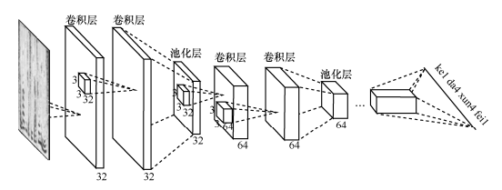
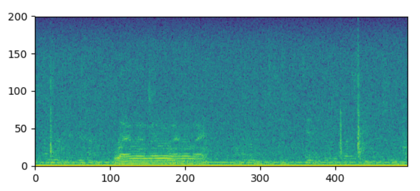
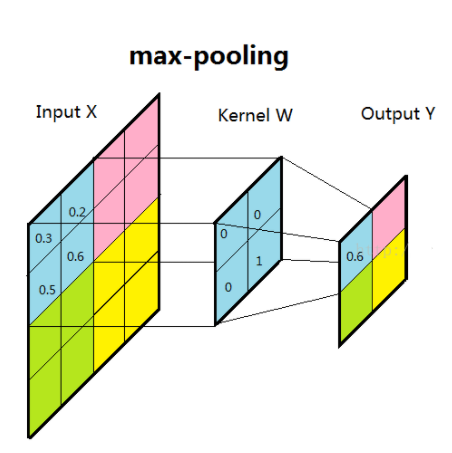
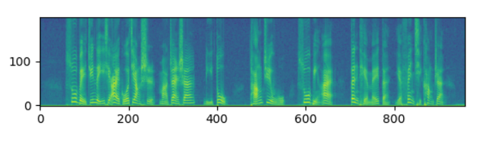
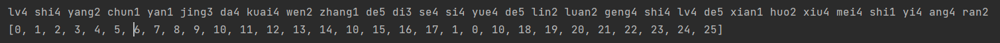
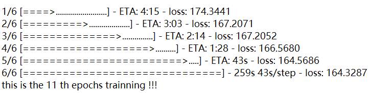
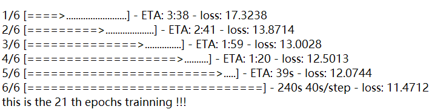
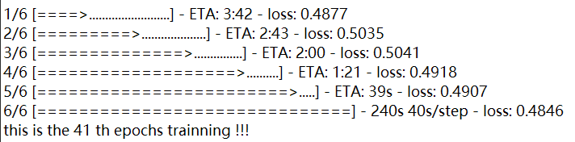
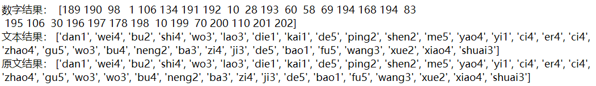
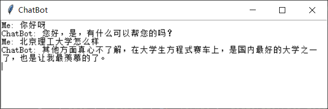

## 语音识别功能的实现

### 接口说明

基本实现了神经网络训练下的语音与音译的转换，但是转换文字的过程中采用的隐马尔可夫效果并不是特别好，与问答系统的对接就不是特别理想，为了方便整个系统运行，最终采用讯飞开放平台的语音转写api，该功能基于深度全序列卷积神经网络框架，通过 WebSocket 协议，建立应用与语言转写核心引擎的长连接，将连续的音频流内容实时识别返回对应的文字流内容。

而本地运行的全序列卷积神经网络（与讯飞语音识别的网络结构几乎一致）识别代码构建也在下面做了说明。

### 深度全序列卷积网络架构

深度全序列卷积神经网络（DFCNN）的网络结构如下：



<center>图 1  DFCNN框架结构图</center>

其中，DFCNN直接将一句语语音转化成一副语谱图作为输入。首先对音频片段每帧进行傅里叶转换、取对数，将时间和频率作为图像的两个维度，可以得到一副语谱图。



<center>图 1  语谱图特征图例</center>

用 3*3 的卷积核对语谱图做卷积。卷积层输出 32 特征。卷积神经网络中的卷积核大小为（3，3），提取32个特征，扩充padding为 1，卷积步长为1，则一次卷积后图像的尺寸变为（n，n）。卷积神经网络可以充分利用语谱图像图像的2D结构，每个输出都通过所有位置的滤波卷积生成。卷积后会生成一个非线性变化单元。
$$
\psi(x)=
\begin{cases}
x; x≥0
\\0; x≤0
\end{cases}
$$
这里会引入最大池化步骤，通过平均感受野的语谱图特征，提取最重要的特征信息。池化层的主要作用是避免噪音等无关紧要的特征，提取处最大参数，减少参数数量，输出 64 特征，使维度减半。



<center>图 2  最大池化结构示意图</center>

此时数据的两个维度减半，再通过一次卷积和池化过程，特征值变为 128 。最后接入全连接层。全连接层的每一个神经元都与前一池化层的所有神经元连接，激励函数使用 $Relu(x) = max(0,x)$ ，最后一层的输出值用softmax进行分类

虽然卷积神经网络早就应用于语音识别系统当中，但很长一段时间内都只能使用固定长度的帧拼接作为输入，不能看到足够长的上下文信息。可以看出，深度全序列卷积神经网络使用了大量的卷积层对整句语音信号进行建模，更好的表达了语音的长时相关性。

### 全序列卷积神经网络代码构建

网络训练所用数据集为清华大学的 THCHS-30 中文语料库，构建的代码文件为voicetotext.py

#### 语音文件与时频图的转换

要用全序列卷积神经网络去识别一段语音，首先要将语音转换成时频图提取图中特征进行处理，用 scipy 计算库得出音频的采样率和波形信息，经过傅里叶转换和取对数后，在汉明窗绘制时频图



#### 发音词典构建

接下来遍历所有的标注文件，统计出发音词典序列并标注序号，这样可以用数字序列来表示音频内容，从而进一步转换为发音序列。可以得到音频文件和标注共13388组，每组对应一句话，字典中共有1209个发音。

例如训练集中的第一个文件对应的文本内容为“绿 是 阳春 烟 景 大块 文章 的 底色 四月 的 林 峦 更是 绿 得 鲜活 秀媚 诗意 盎然”，得到的数字序列和发音序列如下：



#### 音频文件处理

全序列卷积神经网络算法中声学模型有3个 maxpoling 层，每个维度需要被8能够整除

```python
# wav_lst存储了所有音频文件路径，这是处理第一个音频文件时频的操作
fbank = compute_fbank(wav_lst[0])  # compute_fbank时频转化的函数在前面已经定义好了
fbank = fbank[:fbank.shape[0] // 8 * 8, :]
```

处理前的频谱图大小为777 * 200，处理后为776 * 200

#### 数据生成

从13388组中随机选取10000组，每次切片随机取其中四组作为一个batch_size，构成一个tensorflow块，因此四组时频图的大小必须保持一致，在处理时应该适当延长长度较短的时频图。每一组时频图的处理如下：

```python
# 输入序列经过卷积网络后，长度缩短了8倍，因此我们训练实际输入的数据为wav_len//8（网络结构导致）。
def wav_padding(wav_data_lst):
    # 获得四个音频文件时频图的长度
    wav_lens = [len(data) for data in wav_data_lst]
    # 取出最大一个
    wav_max_len = max(wav_lens)
    # 将长度缩短8倍
    wav_lens = np.array([leng // 8 for leng in wav_lens])
    # 列为wav_max_len可保证全部数据都能存下且每个时频文件数据存储格式相同
    new_wav_data_lst = np.zeros((len(wav_data_lst), wav_max_len, 200, 1))
    for i in range(len(wav_data_lst)):
        # 将第i个时频图数据放入第i行的0~wav_data_lst[i].shape[0]列
        new_wav_data_lst[i, :wav_data_lst[i].shape[0], :, 0] = wav_data_lst[i]
    return new_wav_data_lst, wav_lens
```

构建 CNN+DNN+CTC声学模型，模型将卷积神经网络与深度神经网络融合，使用ReLU激活函数和CTC损失函数


### 结果预测

10轮训练迭代过后的损失函数



20轮迭代之后



40轮迭代之后



损失函数已经收敛到了一个较小的值，用训练的模型测试效果：



可以看出准确率的确很高。

### 与问答系统组合后的演示结果



启动后等待人声，‘Me’显示的是使用者说话后转换成文字的序列，ChatBot表示问答系统的输出，同时有人声输出。