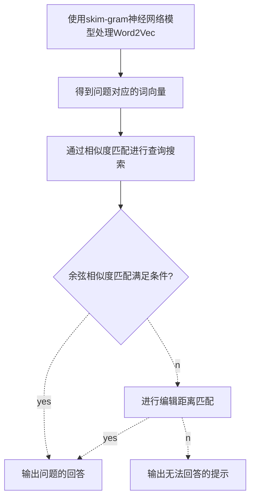

## 基于相似度匹配的问答系统实现

整体思路如下：

首先提出AIML的自定义对话模板，录入各种对话的模板供问答系统来进行使用。之后在进行训练时，将问答语句中的问题转换成词向量的形式，通过skip_gram的神经网络模型训练word2vec。

之后将训练好的word2vec模型录入，将用户输入的问题语句字符串也同样进行向量化处理。处理后，我们先采用余弦相似度匹配的算法进行匹配，查看是否有相应的余弦相似度模板，如果余弦相似度匹配找到了相对应的问题，则输出相对应问题的答案。如果余弦相似度的匹配无法满足要求，那么就根据编辑距离匹配的方式，在问答系统的模型中寻求问题的结果。编辑距离的相似度如果仍旧过低，那么问答系统输出“这个问题我不知道如何回答哦~”。

问答系统中的简易框架如下图所示：



### AIML自定义对话模板

AIML是用于描述一类称为AIML的对象，同时部分描述了计算机程序处理这些对象时的表现。AIML是XML语言（可扩展标记语言）的衍生。

AIML对象是由topic和category单元组成的，格式化或未格式化的数据均可。格式化的数据是由字符组成的，其中有的组成符号数据，有的构成AIML元素。AIML元素将应答数据封装在文档中。包含这些元素的字符数据有可能被AIML解释器格式化，也有可能在之后的响应中处理。

AIML文档中的对话文件以.aiml格式判断，可以用于替换问答系统中输出的语句，用于定义相对应的对话模板。文件部分展示如下图所示：


本文的aiml对话定义模板包含以下几个文件，其中bye.aiml其中包含的是有关再见的对话模板，Common_conversation包含的是有关于日常对话的模板语句，其余也是同样的相关对话模板


加载相关模板规则的python文件位于：matcher/rules/aimlMatcher.py 与matcher/rules/rulesMapper.py 文件中,代码如下：

```python
def add_rules():
    rule_path = os.getcwd()
    mybot = aiml.Kernel()

    # 加载aiml规则模板
    mybot.learn(rule_path + '/matcher/rules/Common_conversation.aiml')
    mybot.learn(rule_path + '/matcher/rules/bye.aiml')
    mybot.learn(rule_path + '/matcher/rules/tuling.aiml')

    mybot.learn(rule_path + '/matcher/rules/tools.aiml')
    mybot.learn(rule_path + '/matcher/rules/bad.aiml')
    mybot.learn(rule_path + '/matcher/rules/funny.aiml')
    mybot.learn(rule_path + '/matcher/rules/OrdinaryQuestion.aiml')
    mybot.learn(rule_path + '/matcher/rules/persionname.aiml')

    return mybot

def get_rules():
    mybot = add_rules()
    return mybot
```

### 使用skip-gram神经网络模型训练Word2Vec

skip-gram模型的输入时一个单词wi，他的输出时wi的上下文，上下文的窗口大小为C。skip-gram的神经网络模型如下图所示：


skip-gram的神经网络模型是从前馈神经网络模型改进来的，在下图中，输入向量x代表某个单词的one-hot编码，对印的输出向量。输入层与隐藏层之间的权重矩阵W的第i行代表词汇表中第i个单词的权重。这个权重矩阵W就是我们需要学习的目标（同W′），因为这个权重矩阵包含了词汇表中所有单词的权重信息。上述模型中，每个输出单词向量也有个$N \times V$维的输出向量W′。最后模型还有NN个结点的隐藏层，我们可以发现隐藏层节点$h_i$的输入就是输入层输入的加权求和。因此由于输入向量x是one-hot编码，那么只有向量中的非零元素才能对隐藏层产生输入。


之后通过反向传播的算法以及随机梯度下降来学习权重矩阵W，第一步即定义损失函数，损失函数为输出单词组的条件概率，$E=-log_p(w_{o,1},w_{o,2},...,w_{o,C}|w_{I})$,之后团队损失函数求导，得到权重矩阵的更新规则：
$$
w(new)=w_{ij}(old)-\eta(\sum_{j=1}^{V}\sum_{c=1}^{C}(y_{c,j}-t_{c,j})\times w_{ij}^{'}\times x_j)
$$
在代码中，我们使用python中的gensim库的Word2Vec中，调取相关参数如下所示：

```python
from gensim.models import Word2Vec
logging.basicConfig(format='%(asctime)s: %(levelname)s: %(message)s')
    logging.root.setLevel(level=logging.INFO)
    inp, outp1, outp2 = corpus_path, path + 'model/all.zh.text.model', path + 'model/all.zh.text.vector'
    model = Word2Vec(LineSentence(inp), size=200, window=5, min_count=2,
                     workers=multiprocessing.cpu_count())
    model.save(outp1)
```

### 句子词向量的余弦相似度匹配法

词向量可以表示单词间的内在联系，即两个单词的词向量通过计算可以得出其关联程度，根据上面使用skip-gram的方法，将用户的提问使用word2vec的方法转换成词向量的方式。根据词向量与训练模型库词向量的相似度，依据相似度的大小对句子间的余弦相似度进行匹配。我们采用余弦相似度的比较方式，两个向量直接余弦相似度公式如下：
$$
cos(\theta)=\frac{\sum_{i=1}^{n}(X_i \times Y_i)}{\sqrt{\sum_{i=1}^{n}(X_i)^2}\times\sqrt{\sum_{i=1}^{n}(Y_i)^2}}
$$
显然，两个特征的余弦相似度计算出来的范围为[-1，1]。当两个单词向量的余弦相似度夹角为0度时，即余弦相似度为1时，表示向量X和向量Y应该是最相似的；夹角为90度是余弦相似度为0，表示向量X与向量Y无关。

我们根据句子词向量之间的相似度，来判断问题之间的相似性，相似性越高。根据相似性匹配问题，从训练集中寻找问题的回答。

余弦相似度的匹配算法位于matcher/rules/vectorMatcher.py函数中，加载pre-trained词向量模型，将句子进行向量化，将用户的输入转化为向量来表示，通过加权平均的方式进行向量化，向量化后可以进行距离的匹配。距离匹配位于chat.py中：

```python
 vec_model = vectorMatcher.load_w2vModel()
 cosine_sim = vectorMatcher.match(inputs_seg, sent_vec, vec_model)
 try:
            # 保留余弦相似度top10
            response_frame = sent_vec.sort_values(by='cosine', ascending=False)[:10]
            # print response_frame
        except:
            response_frame = None

```
在这里运用到了搜索与问题求解的相关知识，即将问答系统中问题的回答分为两方面，一方面是基于余弦相似度的匹配，一方面是基于编辑距离匹配，两者中只要有一种方式可以进行求解，得到相应的问题解决方案即可。即在与或图的处理中，余弦相似度和编辑距离相似度匹配的解决方法是或的关系。

之后保留前十的余弦相似度，在保留时如果相似度大于0.6，则输出相似性最高问题的回答，如果小于等于0.6，则根据编辑距离匹配的方法，求相似度最高的回答秒如果仍小于限定值，则输出：“这个问题我不知道如何回答哦~”


### LevenshteinMatcher编辑距离匹配的方法

Levenshtein 距离，又称编辑距离，指的是两个字符串之间，由一个转换成另一个所需的最少编辑操作次数。编辑距离用于模糊查询和数据匹配效果较好，许可的编辑操作包括将一个字符替换成另一个字符，插入一个字符，删除一个字符。

即S1、S2表示两个字符串，S1(i)表示S1的第一个字符，d[i, j]表示S1的第i个前缀到S2的第j个前缀（例如:S1 = ”abc”,S2 = ”def”,求解S1到S2的编辑距离为d[3, 3]）。

这里采用python中的Levenshtein库，来实现编辑距离匹配的方法：

```python
from Levenshtein import *
def acquaintance(a,b):
    for i in a:
        item = {}
        for j in b:
            if ratio(u"%s"%i,u"%s"%j):
                item[ratio(u"%s"%i,u"%s"%j)] = (i,j)
        d = item[max(list(item.keys()))]
        c = '"%s"和"%s"-最相似---匹配度为：%f'%(d[0],d[1],max(list(item.keys())))
        print(c)
```

得到两个字符串的编辑距离比，使用ratio可以将距离进行归一化，得到一个值，来表征两个问题之间的相似度。

